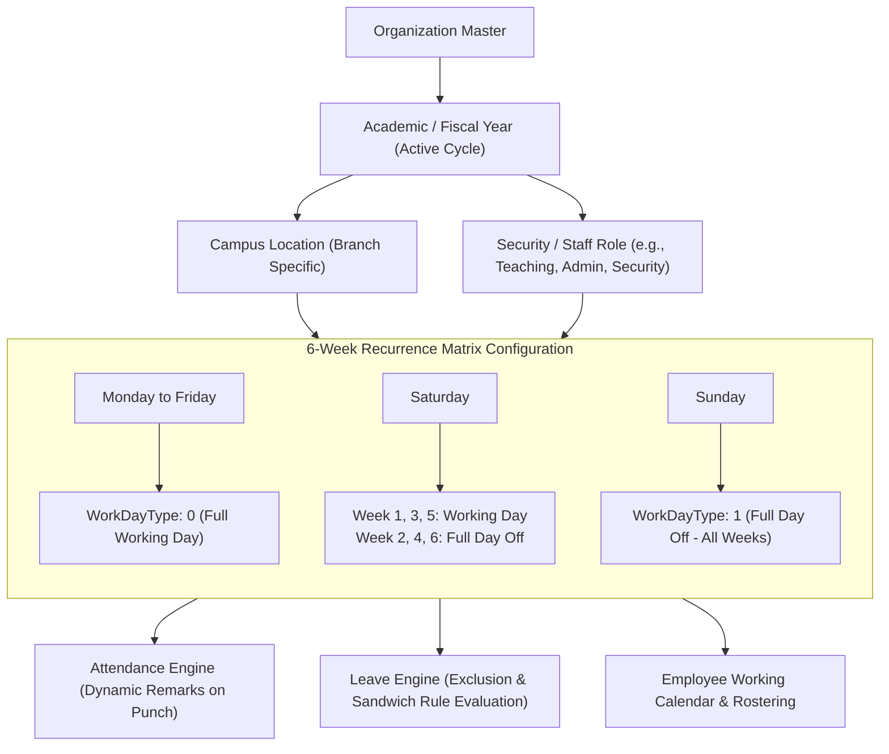
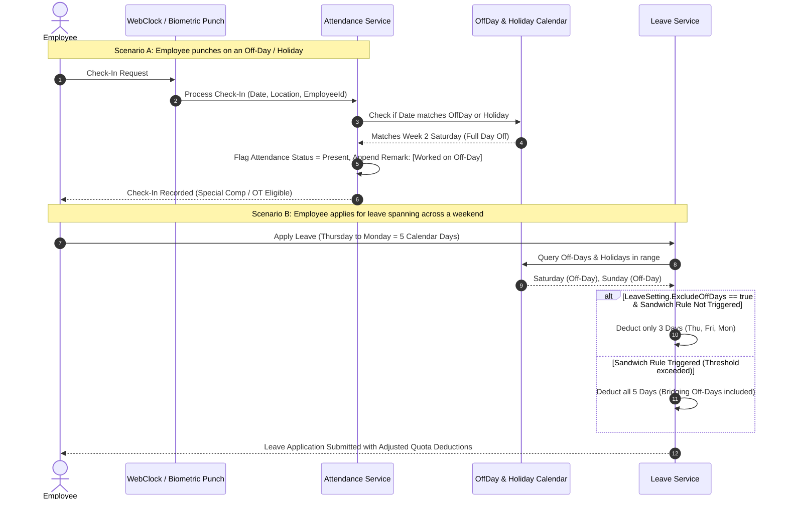

# HRAttendance System — Comprehensive Features Documentation
*(Excluding Payroll Management)*

---

## 1. System Overview & Architectural Foundation

**HRAttendance** is an enterprise-grade, multi-tenant SaaS Workforce & Human Resource Management System built on a **3-tier modular monolithic architecture**. The system is engineered to provide strict domain encapsulation, high performance, auditability, and role-based access control (RBAC).

```
┌─────────────────────────────────────────────────────────────┐
│               Frontend Web Client (React 18)                │
│       Vite + TypeScript + Tailwind CSS + TanStack Query     │
└──────────────────────────────┬──────────────────────────────┘
                               │ REST / JSON (JWT Authenticated)
                               ▼
┌─────────────────────────────────────────────────────────────┐
│                Presentation Layer (API)                     │
│         ASP.NET Core 10 Web API, Thin Controllers           │
│   FluentValidation, RFC 7807 ProblemDetails, Global Filter  │
└──────────────────────────────┬──────────────────────────────┘
                               │
                               ▼
┌─────────────────────────────────────────────────────────────┐
│                 Business Logic Layer                        │
│   Domain Services, Validation Rules, Geofence Computations, │
│        Leave Deductions, Overtime Engine, Password Hashing  │
└──────────────────────────────┬──────────────────────────────┘
                               │
                               ▼
┌─────────────────────────────────────────────────────────────┐
│                  Data Access Layer                          │
│     Entity Framework Core 10, Repositories, Migrations      │
│    Global Soft-Delete Query Filters, Audit Interceptors     │
└──────────────────────────────┬──────────────────────────────┘
                               │
                               ▼
┌─────────────────────────────────────────────────────────────┐
│                  SQL Server / Azure SQL                     │
│    Relational Integrity, Decimal Precision, Foreign Keys    │
└─────────────────────────────────────────────────────────────┘
```

### 1.1 Technology Stack
- **Backend**: .NET 10 (`net10.0`), C# 14, ASP.NET Core Web API
- **ORM & Database**: Entity Framework Core 10, Microsoft SQL Server / Azure SQL
- **Authentication**: JWT Bearer Tokens (`System.IdentityModel.Tokens.Jwt`), PBKDF2 with SHA-256 password hashing (10,000 iterations, 128-bit salt, 256-bit subkey)
- **Validation**: FluentValidation with automatic model validation
- **Exception Handling**: RFC 7807 compliant `ProblemDetails` via `GlobalExceptionMiddleware`
- **Frontend**: React 18, TypeScript, Vite, Tailwind CSS with custom design tokens
- **Server State & Caching**: TanStack Query (React Query v5) with optimistic cache invalidation
- **HTTP Layer**: Centralized Axios client with automatic Bearer token injection and 401 response interceptors
- **Icons & UI Components**: Lucide React, accessible modal/drawer primitives, customizable data tables

### 1.2 Multi-Tenancy & Data Isolation
- Every domain table contains an `OrganizationId` foreign key referencing the `Organizations` master table.
- All database queries and modifications strictly partition data by `OrganizationId`.
- Global soft-deletion (`IsDeleted == false`) is enforced via EF Core query filters across all queries.
- Automated audit tracking: Every table tracks `CreatedAt`, `CreatedBy`, `ModifiedAt`, and `ModifiedBy`.

---

## 2. Authentication, Authorization & Security (RBAC)

The system implements a granular, claim-based Role-Based Access Control (RBAC) model supporting standard application tiers and customizable permissions.

### 2.1 Role Hierarchy & System Tiers
1. **Super Admin**: Complete tenant control, cross-organization configuration, branding, and role assignments.
2. **HR / Admin**: Employee onboarding, department assignment, shift rostering, holiday declaration, leave policy setup, and attendance regularization.
3. **Manager**: Direct-report supervision, team schedule tracking, attendance review, leave approval/rejection, and overtime approval.
4. **Employee**: Self-service terminal, biometric/web clock-in/out, personal attendance history, leave application, and profile management.

### 2.2 Granular Master Permissions (`PermissionMaster`)
Permissions are categorized into domain-specific actions and linked via `RolePermissions`:

| Category | Sample Permissions | Description |
| :--- | :--- | :--- |
| **Organization** | `Organization.View`, `Organization.Update`, `Organization.Manage` | Manage company legal profile, address, and logo. |
| **Locations** | `Location.View`, `Location.Create`, `Location.Edit`, `Location.Delete`, `Location.CaptureGPS` | Campus management and GPS geofencing. |
| **Departments** | `Department.View`, `Department.Create`, `Department.Edit`, `Department.Delete` | Departmental divisions and head assignments. |
| **Designations** | `Designation.View`, `Designation.Create`, `Designation.Edit`, `Designation.Delete` | Career levels and job titles. |
| **Employees** | `Employee.View`, `Employee.Create`, `Employee.Edit`, `Employee.Update`, `Employee.Delete`, `Employee.ViewSelf`, `Employee.EditSelf` | Complete 360° employee profile lifecycle. |
| **Attendance** | `Attendance.View`, `Attendance.ViewAll`, `Attendance.Punch`, `Attendance.ManualPunch`, `Attendance.Manage`, `Attendance.Regularize` | WebClock, admin overrides, and regularization. |
| **Leaves** | `Leave.Apply`, `Leave.View`, `Leave.ViewAll`, `Leave.Approve`, `Leave.Reject`, `Leave.Cancel`, `Leave.ManageTypes`, `Leave.Configure`, `Leave.Adjust` | End-to-end leave workflows and quotas. |
| **Overtime** | `Overtime.View`, `Overtime.Request`, `Overtime.Approve`, `Overtime.Reject`, `Overtime.Manage` | OT thresholds, rate multipliers, and claims. |
| **Shifts** | `Shift.View`, `Shift.Create`, `Shift.Edit`, `Shift.Assign` | Shift scheduling and bulk assignment. |
| **Holidays** | `Holiday.View`, `Holiday.Manage`, `OffDay.View`, `OffDay.Manage` | Calendar setup and 6-week off-day recurrence matrix. |
| **Security & Roles** | `Role.View`, `Role.Create`, `Role.Edit`, `Role.Assign`, `Permission.View`, `Permission.Manage` | Custom security roles and access matrices. |

### 2.3 Client-Side Security Gates
- **`<RequireAuth>`**: Route wrapper preventing unauthenticated access and redirecting expired sessions.
- **`<PermissionGuard>`**: Declarative component-level gate rendering fallbacks or hiding controls when claims are missing:
  ```tsx
  <PermissionGuard permission="Attendance.Manage" fallback={<ReadOnlyView />}>
    <Button onClick={handleAdminMark}>Regularize Attendance</Button>
  </PermissionGuard>
  ```
- **Dynamic Navigation Filtering**: Sidebar menu items adapt dynamically to the authenticated user's permission set.

---

## 3. Organization & Multi-Campus Setup

### 3.1 Organization Legal Profile
- Comprehensive corporate identity: Company Name, Phone, Email, Fax, Website, Industry, Postal/Physical Address.
- **Branding Assets**: Dynamic logo upload (`/api/organization/{id}/logo`) with real-time preview and public branding endpoint (`/api/organization/public-branding`) for login page white-labeling.

### 3.2 Campus Locations & Geofencing
- Supports multi-campus organizations with distinct physical operating locations.
- **Geographic Coordinates**: Stores latitude, longitude, and an allowed proximity radius (in meters).
- **Geofence Enforcement Toggle (`EnforceGeofence`)**: When active, mobile and web clock-ins are validated against the campus location using the Haversine distance formula.
- **One-Click Browser GPS Capture**: Administrators can automatically capture their current device GPS coordinates directly in the UI modal to configure campus geofences accurately.
- **Timezone Management**: Configurable timezones per location for global workforce distribution.

### 3.3 Academic & Operational Cycles (`AcademicYears`)
- Organizations operate under defined academic/fiscal operational cycles with explicit `StartDate` and `EndDate`.
- **Active Cycle Flag**: The active academic year anchors all leave quotas, attendance cycles, off-day schedules, and holiday calendars.

---

## 4. Master Data & Hierarchy Management

### 4.1 Department Management
- Flexible departmental unit configuration (Engineering, Operations, HR, Sales, etc.).
- **Department Head Assignment**: Assigns an active employee as the department manager (`DepartmentHeadId`), establishing approval routing hierarchies.

### 4.2 Job Designations
- Career tracks, job titles, and seniorities across the organization.
- Bound to employees for directory filtering, reporting, and role scoping.

### 4.3 Holiday Calendars
- Supports organization-wide holidays and campus-specific regional holidays (`LocationId` nullable).
- **Optional / Observance Flag**: Distinguishes between mandatory organizational shutdowns and optional cultural/religious holidays.
- Integrated into attendance validation and dashboard widgets (next 60 days).

### 4.4 Advanced Off-Day & Calendar Working Days Matrix (`OffDays`)

The system eliminates rigid assumptions (such as fixed Saturday-Sunday weekends) and provides a dynamic, enterprise-grade calendar scheduling engine that models complex academic and corporate working-day patterns.

#### 4.4.1 Calendar Architecture & Scoping Hierarchy



#### 4.4.2 Core Configuration Rules & Fields
- **6-Week Recurrence Grid (`Week1` - `Week6`)**: Handles months that span across up to 6 distinct calendar weeks. This enables real-world institutional policies such as:
  - **Alternate Saturdays**: 1st, 3rd, and 5th Saturdays are active working days; 2nd and 4th Saturdays are off-days.
  - **Half-Day Weekends**: Working half-days on certain Saturdays or Fridays.
  - **Standard Weekends**: Full day off on all Sundays across Weeks 1 to 6.
- **Work Day Type Classifications (`WorkDayType`)**:
  - `0`: **Working Day** (Full regular work day)
  - `1`: **Full Day Off** (Complete rest day / weekly off)
  - `2`: **Half Day Off** (Scheduled half work day)
- **Multi-Tenant & Role Scoping**: Off-day calendars can be independently configured per:
  - `AcademicYearId`: Bound to active fiscal/academic cycles.
  - `LocationId`: Branch/campus-specific off-days.
  - `RoleId`: Enables separate work schedules for shift workers, front-desk staff, teaching faculty, and corporate administrators.
- **Matrix Synthesis API (`includeWorkingDays = true`)**:
  - The backend dynamically merges explicitly declared off-days with implicit regular working days.
  - Returns a unified, complete 7-day $\times$ 6-week matrix ensuring that any day not explicitly marked as an off-day is accurately represented as a full working day (`WorkDayType = 0`).

#### 4.4.3 Example Institution Calendar Matrix

| Weekday | Work Day Type | Week 1 | Week 2 | Week 3 | Week 4 | Week 5 | Week 6 | Operational Interpretation |
| :--- | :--- | :---: | :---: | :---: | :---: | :---: | :---: | :--- |
| **Monday** | Full Working Day (0) | 🟢 Work | 🟢 Work | 🟢 Work | 🟢 Work | 🟢 Work | 🟢 Work | Standard working day |
| **Tuesday** | Full Working Day (0) | 🟢 Work | 🟢 Work | 🟢 Work | 🟢 Work | 🟢 Work | 🟢 Work | Standard working day |
| **Wednesday** | Full Working Day (0) | 🟢 Work | 🟢 Work | 🟢 Work | 🟢 Work | 🟢 Work | 🟢 Work | Standard working day |
| **Thursday** | Full Working Day (0) | 🟢 Work | 🟢 Work | 🟢 Work | 🟢 Work | 🟢 Work | 🟢 Work | Standard working day |
| **Friday** | Full Working Day (0) | 🟢 Work | 🟢 Work | 🟢 Work | 🟢 Work | 🟢 Work | 🟢 Work | Standard working day |
| **Saturday** | Full Day Off (1) | 🟢 Work | 🔴 Off | 🟢 Work | 🔴 Off | 🟢 Work | 🔴 Off | Alternate Saturday off (Weeks 2, 4, 6) |
| **Sunday** | Full Day Off (1) | 🔴 Off | 🔴 Off | 🔴 Off | 🔴 Off | 🔴 Off | 🔴 Off | Universal weekly off |

#### 4.4.4 Cross-Module Interactions: How Off-Days Affect Operations




---

## 5. Employee Lifecycle & 360° Profiles

The Employee Management module provides a comprehensive 33-field profile system covering personal, contact, professional, and system authorization details.

### 5.1 Employee Directory
- Real-time directory with search across employee code, name, and email.
- Multi-criteria filtering by Department, Designation, Location, and Active/Inactive status.
- Grid and table view modes with responsive cards and pagination controls.

### 5.2 360° Profile Structure
The profile is partitioned into logical domains:
- **Personal Information**: Full legal name (First, Middle, Last), Father's Name, Mother's Name, Date of Birth, Gender, Blood Group, Marital Status, Nationality, Religion, Birth Place, Identification Marks, Employee Type (Full-Time, Contract, Intern).
- **Contact & Emergency Details**: Current residential address, Permanent address, City, State, Country, Postal Code, Work Email, Personal Email, Mobile Number, Extension, Work/Home Telephone, Emergency Contact Person, Emergency Phone Number.
- **Professional & Placement Details**:
  - Department and Designation linking.
  - Base Campus Location.
  - Assigned Work Shift.
  - Direct Reporting Manager (`ReportingTo`) establishing the management hierarchy.
  - Date of Joining, Probation Period (months), and Notice Period (days).
- **Media & Profile Customization**:
  - Avatar Photo Upload: Managed via `/api/employee/{id}/photo` with local file system storage, unique UUID naming, and automatic profile picture sync in headers.
  - Cover Banner Upload: Managed via `/api/employee/{id}/background`, allowing customizable background headers.
- **Lifecycle & Separation**: Resignation date, last working day, reason for leaving, and active/inactive toggle.

### 5.3 Self-Service vs. Administrative Privileges
- Employees can view their 360° profile and edit their personal contact/emergency details via the self-service portal.
- Administrative fields (Department, Shift, Reporting Manager, Role assignments, Salary/Job status) require privileged permissions (`Employee.Edit` / `Employee.Manage`).

---

## 6. Shift Scheduling & Workforce Rostering

### 6.1 Shift Definitions (`Shifts`)
- **Working Hours**: Precise start time (`InTime`) and end time (`OutTime`).
- **Overnight Shifts (`IsOvernight`)**: First-class support for night shifts spanning across midnight into the following calendar day.
- **Late Grace Period (`GraceMinutes`)**: Configurable buffer (e.g., 15 minutes) before an employee check-in is flagged as `Late`.
- **Break Configurations**: Defined `BreakStartTime`, `BreakEndTime`, and total `BreakMinutes` for accurate net working hour computations.
- **Location Linkage**: Shifts can be bound to specific campus facilities.

### 6.2 Shift Rostering & Assignment
- **Individual Assignment**: Directly assign shifts to employees via their professional profile.
- **Bulk Shift Assignment**: Administrative tool to assign a shift to entire departments or multi-selected employee batches in a single operation.
- **Shift Studio Visualization**: Visual schedule viewer displaying shift coverage and team roster assignments.

---

## 7. Time & Attendance Operations

The Time & Attendance module provides automated biometric, GPS-validated web clocking, and operational monitoring.

```
                  ┌──────────────────────────────┐
                  │      Employee WebClock       │
                  │   (GPS + Device Telemetry)   │
                  └──────────────┬───────────────┘
                                 │
                                 ▼
                  ┌──────────────────────────────┐
                  │    Validation Engine         │
                  ├──────────────────────────────┤
                  │ 1. Duplicate check?          │
                  │ 2. Approved leave today?     │
                  │ 3. Geofence radius valid?    │
                  │ 4. Shift & grace period?     │
                  │ 5. Holiday or off-day check? │
                  └──────────────┬───────────────┘
                                 │
                                 ▼
                  ┌──────────────────────────────┐
                  │   Record Attendance Entry    │
                  │   Status: Present / Late     │
                  └──────────────────────────────┘
```

### 7.1 Real-Time WebClock Terminal
- **Interactive Live Clock**: Digital clock with seconds-level precision and local timezone awareness.
- **Today's Status Card**: Displays instant punch status (`NotCheckedIn`, `CheckedIn`, `CheckedOut`), punch timestamps, location, and elapsed work hours.
- **Live Elapsed Counter**: Dynamically computes hours and minutes worked in the active shift session.

### 7.2 Validation & Business Rules Engine
When an employee punches in or out, the backend enforces several business constraints:
1. **Single Check-In Rule**: Blocks duplicate check-ins for the same calendar date.
2. **Approved Leave Guard**: Rejects check-in if the employee has an approved leave scheduled for the current date.
3. **Haversine Geofence Validation**:
   - If campus geofencing is enabled, the system computes the distance between the employee's browser GPS coordinates and the campus coordinates:
     $$d = 2R \cdot \arcsin\left(\sqrt{\sin^2\left(\frac{\Delta\phi}{2}\right) + \cos(\phi_1)\cos(\phi_2)\sin^2\left(\frac{\Delta\lambda}{2}\right)}\right)$$
   - If the distance exceeds the campus radius, the punch is rejected with an explicit distance explanation.
4. **Automated Late Arrival Calculation**:
   - If `CheckInTime > Shift.InTime + Shift.GraceMinutes`, the record is marked with status `Late`.
5. **Holiday & Off-Day Recognition**:
   - Punches on declared holidays or scheduled off-days automatically append contextual tags (e.g., `[Worked on Holiday: Independence Day]`, `[Worked on Off-Day]`).
6. **Automatic Overtime Detection**:
   - On checkout, if actual checkout exceeds the shift end time plus the overtime buffer threshold, an overtime record (`OTEntry`) is automatically created.
7. **Hardware & Telemetry Auditing**: Captures client platform, browser user agent, IP network source, MAC address (where provided), and app version.

### 7.3 Attendance Calendar & Day Detail Drawer
- **Monthly Interactive Grid**: Shows an entire month with color-coded day pills:
  - 🟢 **Present**: On-time shift completion.
  - 🟡 **Late**: Arrived after grace period.
  - 🟠 **Half Day**: Half-day worked or approved half-day leave.
  - 🔴 **Absent**: No check-in recorded.
  - 🔵 **On Leave**: Approved leave.
  - 🟣 **Holiday**: Official organization or campus holiday.
  - ⚪ **Weekend / Off-Day**: Scheduled off-day per recurrence matrix.
- **Day Detail Slide-Over Drawer**: Clicking any date opens a slide-over panel displaying punch in/out timestamps, total work hours, active shift name, campus location, and remark annotations.

### 7.4 Attendance Operations & Regularization
- **Daily Company Roster**: Real-time operational dashboard displaying today's attendance metrics (Present count, Late arrivals, Absent employees, Attendance Rate %).
- **Manual Punch Modal**: Allows managers/admins to log missed punches for biometric failures or fieldwork.
- **Administrative Attendance Regularization**: Privileged interface to modify punch times, update statuses, change locations, and enter audit remarks for historical records.

---

## 8. Leave & Time-Off Management

The Leave Management module provides a complete policy engine, employee self-service portal, multi-tier approval chains, and bulk quota allocation.

### 8.1 Leave Types & Policy Configuration (`LeaveSettings`)
Organizations can configure custom leave policies (e.g., Casual Leave, Sick Leave, Privilege/Earned Leave, Maternity, Paternity, Bereavement, Unpaid LOP):

| Policy Rule | Options / Description |
| :--- | :--- |
| **Paid / Unpaid** | Determines whether leave is compensated. |
| **Gender & Marital Eligibility** | Restricts specific leaves (e.g., Maternity for female employees, Paternity for male employees). |
| **Half-Day Allowance** | Allows employees to request half-day leaves (0.5 day deduction). |
| **Probation Rules** | `AllowedInProbation` flag and `InitialValueDuringProbation` quotas. |
| **Calendar Exclusions** | `ExcludeHolidays` and `ExcludeOffDays` flags prevent deducting off-days within a leave span. |
| **Sandwich Rule** | `IncludeHolidaysOffdaysAfterdays` treats bridging off-days as leave if the consecutive duration threshold is met. |
| **Application Constraints** | `MaximumNoConsecutiveLeaveAllowed`, `LeaveApplicationBeforeDays` (advance notice), and `BackdateAllowed`. |
| **Accrual & Carry Forward** | Annual allocation vs. periodic accrual, maximum yearly accrual, and `CarryForwardLeaveCount` limits. |

### 8.2 Employee Leave Portal
- **Real-Time Quota Cards**: Visual cards displaying Credited, Brought Forward, Leaves Taken, and Net Available balances for each leave type.
- **Application Drawer**:
  - Date range picker (`FromDate` to `ToDate`).
  - Single-day half-day toggle.
  - Real-time balance validation preventing applications exceeding available quota.
  - Overlapping application detection preventing double-booking dates.
  - Reason field for managerial review.
- **Daily Sub-Applications (`SubLeaveApplication`)**: When a multi-day leave is submitted, the system generates individual daily sub-records, enabling granular day-by-day attendance integration and partial cancellations.
- **Self-Service Cancellation**: Employees can cancel pending applications or approved future leaves, automatically restoring deducted quotas.

### 8.3 Multi-Tier Approval Workflow
- Dedicated **Leave Approvals Page** for Managers and HR Admins.
- Filterable pending requests queue showing employee name, leave type, date span, duration, reason, and submission timestamp.
- One-click **Approve** or **Reject** with optional managerial comments.
- **Automatic Quota Deduction**: Approving an application deducts the requested days from the employee's active `EmployeeLeaves` balance for the active academic year.

### 8.4 Leave Balance Registry & Bulk Allocation
- **Organization-Wide Registry**: Search and filter leave balances across all employees, departments, and academic years.
- **Manual Balance Adjustments**: Modal allowing HR admins to modify credited, brought forward, or taken balances with audit notes.
- **Bulk Allocation Engine**: Automatically populates standard annual leave quotas for all employees (or filtered by department) for a selected academic year, with optional overwrite protection.

---

## 9. Overtime (OT) Operations

### 9.1 Overtime Policy Configuration (`OTSettings`)
- **Master Switch**: Enable or disable overtime accrual organization-wide.
- **OT Start Buffer (`OTStartAfterMinutes`)**: Minimum extra minutes worked after shift end before overtime begins accruing (e.g., 30 minutes).
- **Compensatory Multipliers**: Configurable overtime multiplier rate (e.g., 1.5x for standard overtime, 2.0x for holiday work).
- **Threshold Caps**: Maximum allowed overtime hours per Day, per Week, and per Month to prevent employee fatigue and enforce labor compliance.

### 9.2 Overtime Tracking & Logging
- **Automated Checkout Accrual**: When an employee checks out after the OT buffer threshold, the attendance engine automatically calculates net overtime hours and logs an `OTEntry`.
- **Manual Overtime Claims**: Slide-over drawer allowing employees and supervisors to submit manual overtime claims for special assignments, weekend shifts, or off-site duties.

### 9.3 Overtime Approvals
- Pending overtime review queue for managers and HR admins.
- Verification of shift end time versus actual checkout time.
- Direct approval/rejection actions storing reviewer identity and approval timestamps.

---

## 10. Role-Based Dashboards & Analytics

The system features tailored dashboards providing actionable insights for each user persona.

### 10.1 Employee Self-Service Dashboard
- **WebClock Quick Action**: 1-click check-in and check-out terminal.
- **Today's Shift Card**: Displays assigned shift timings, grace period allowances, and break windows.
- **Current Month Attendance KPI Cards**:
  - Days Present
  - Days Absent
  - Late Arrivals
  - Half Days
  - On Leave Count
  - Total Overtime Hours
  - Monthly Attendance Rate (%)
- **Leave Quota Progress Bars**: Visual progress indicators showing utilized vs. remaining leave days per category.
- **Upcoming Campus Holidays**: Next 60 days of declared holidays filtered to the employee's campus location.
- **Recent Punch Activity**: Timeline of the last 7 days of punch activity with durations and remarks.

### 10.2 Employee Calendar View
- Dedicated month-by-month interactive calendar view combining:
  - Daily punch records with exact in/out times.
  - Approved leave durations.
  - Campus and national holidays.
  - Role-specific weekly off-days.
- Provides a single, unified view of the employee's working schedule.

---

## 11. In-App Notifications & Enterprise Auditability

### 11.1 Notification Hub
- **Notification Slide-Over Drawer**: Accessible via the top navigation bar with real-time unread badge counts.
- **Targeted Notification Types**:
  - Leave application submissions, approvals, and rejections.
  - Overtime claim submissions and approval alerts.
  - Attendance regularization notifications.
  - General organization-wide announcements.
- **Interactive Action Links**: Notifications include direct URLs linking users to the relevant page (e.g., linking a manager directly to a pending leave approval).
- **Read / Unread State Management**: Single-click mark-as-read and bulk clear actions.

### 11.2 Enterprise Auditability & Compliance
- **Audit Columns**: Every database model implements `CreatedAt`, `CreatedBy`, `ModifiedAt`, and `ModifiedBy`.
- **Global Soft-Deletion**: No master or transactional data is permanently dropped during standard operations. Entities set `IsDeleted = true`, preserving historical referential integrity for audits and historical reporting.

---

## 12. API Ecosystem & Integration Architecture

### 12.1 RESTful Architecture & RFC 7807 Standards
- Clean, resource-oriented REST endpoints built with ASP.NET Core Controllers.
- All successful responses wrap payloads in a standardized contract:
  ```json
  {
    "success": true,
    "message": "Operation completed successfully.",
    "data": { ... }
  }
  ```
- Error responses adhere to RFC 7807 `ProblemDetails` with detailed validation dictionaries:
  ```json
  {
    "type": "https://tools.ietf.org/html/rfc7231#section-6.5.1",
    "title": "One or more validation errors occurred.",
    "status": 400,
    "errors": {
      "EmployeeCode": ["Employee code 'EMP001' is already registered."]
    }
  }
  ```

### 12.2 OpenAPI / Swagger Documentation
- Fully documented Swagger UI exposed at the API root URL (`/`).
- Interactive JWT Bearer token authorization support directly in Swagger UI for endpoint testing.

### 12.3 Automated Testing Suites
- **Postman Collection**: `HRAttendance.postman_collection.json` covering all core modules.
- **Automated Regression Scripts**:
  - `test_all_apis.mjs`: Complete Node.js / ES Module automated integration test script.
  - `test_all_apis.py`: Python-based REST validation suite.
- **Unit & Integration Tests**: xUnit test suites in `tests/HRAttendance.UnitTests` and `tests/HRAttendance.IntegrationTests` verifying business rules, password hashing, and API controller responses.

---

## 13. Summary Matrix of Non-Payroll Application Features

| Module | Core Capabilities | Primary Roles |
| :--- | :--- | :--- |
| **Authentication & Security** | JWT login, PBKDF2 hashing, session resolution (`/api/auth/me`), 40+ master permissions, declarative `<PermissionGuard>` | All Users |
| **Organization Management** | Corporate profile, branding logo upload/preview, multi-campus setup, browser GPS coordinate capture, academic cycles | Super Admin, HR/Admin |
| **Master Data & Calendars** | Departments, department heads, designations, global/campus holiday calendars, and dynamic 6-week Off-Day & Calendar Working Days matrix | Super Admin, HR/Admin |
| **Employee Management** | 33-field profile, employee directory, 360° profile view, avatar photo upload, cover banner upload, emergency contacts, reporting hierarchy | Super Admin, HR/Admin, Manager, Employee |
| **Shift Scheduling** | Day/overnight shifts, grace periods, break rules, individual & bulk shift assignments, shift studio roster | HR/Admin, Manager |
| **Time & Attendance** | Live WebClock, Haversine GPS geofencing, duplicate punch guard, late arrival calculation, holiday/off-day detection, monthly attendance calendar, day detail drawer, manual punch, administrative regularization | All Users |
| **Leave Management** | Configurable leave policies, leave portal, quota balances, multi-day/half-day applications, overlap guard, manager approval queue, cancellation with balance restoration, bulk quota allocation | All Users |
| **Overtime (OT)** | Policy rules, rate multipliers, daily/monthly caps, automated checkout accrual, manual OT claims, approval queue | HR/Admin, Manager, Employee |
| **Dashboards & Analytics** | Clock-in terminal, today's shift card, monthly attendance KPIs, leave quota progress bars, upcoming holidays, recent punch timeline, interactive employee calendar | Employee, Manager, HR/Admin |
| **Notifications & Audit** | In-app notification drawer, unread badges, action links, entity audit timestamps (`CreatedAt`, `ModifiedAt`), global soft-deletion | All Users |
