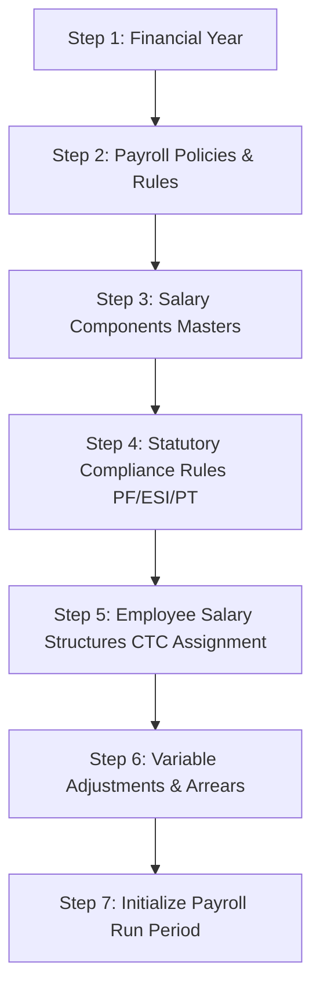
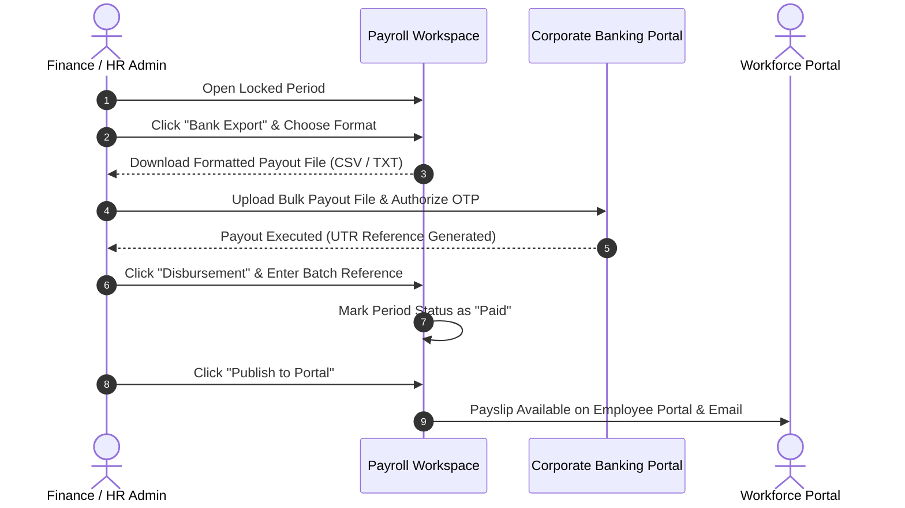

# HRAttendance System — Comprehensive Payroll Management & Payout Guide

---

## 1. Executive Summary & Architecture Overview

The **HRAttendance Payroll Management System** is an enterprise-grade compensation engine fully integrated with the attendance, leave, shift, and employee lifecycle subsystems. It is designed for multi-tier organizations operating under statutory compliance regimes (such as Indian PF, ESI, Professional Tax, and TDS) while supporting customizable compensation structures, mid-month salary revisions, attendance-based Loss of Pay (LOP), approved overtime, and batch banking disbursements.

```
┌────────────────────────────────────────────────────────────────────────────────────────┐
│                               PAYROLL ENGINE PIPELINE                                  │
├────────────────────────────────────────────────────────────────────────────────────────┤
│                                                                                        │
│   ┌─────────────────────┐    ┌─────────────────────┐    ┌──────────────────────────┐   │
│   │   1. Masters & FY   │    │ 2. Salary Structures │    │ 3. Attendance & Leaves   │   │
│   │  Financial Years,   │───▶│  Basic, HRA, Allow, │───▶│ Present, Half-day, LOP,  │   │
│   │  Policies & Rules   │    │   PF, ESI, PT, TDS  │    │      Approved OT Hours   │   │
│   └─────────────────────┘    └─────────────────────┘    └──────────────────────────┘   │
│                                                                      │                 │
│                                                                      ▼                 │
│   ┌─────────────────────┐    ┌─────────────────────┐    ┌──────────────────────────┐   │
│   │   6. Disbursement   │    │ 5. Approval & Freeze│    │ 4. Calculation Engine    │   │
│   │  NEFT / RTGS Export,│◀───│  Executive Approval,│◀───│  Proration Slices, LOP,   │   │
│   │  Bank Payout & Slips│    │  Immutable Lock (FnF│    │  Statutory Deductions, Net   │   │
│   └─────────────────────┘    └─────────────────────┘    └──────────────────────────┘   │
│                                                                                        │
└────────────────────────────────────────────────────────────────────────────────────────┘
```

### Key Architectural Tenets
1. **Immutable Snapshots**: Once a payroll period is calculated and locked, an immutable policy snapshot (`PolicySnapshotJson`) and row-versioned employee payslip records preserve financial integrity against retrospective changes.
2. **Mid-Month Revision Proration**: Automatically slices compensation into multiple date ranges when salary increments or promotions take effect mid-month.
3. **Bi-directional Attendance Sync**: Automatically aggregates biometric punches, regularized attendances, approved leaves, and overtime hours from the Core Attendance Engine.
4. **Dual Control (Maker-Checker)**: Calculations performed by HR/Admin require executive review, audit stamping (`ApprovedBy`), and authorization before financial freezing (`LockedBy`) and bank disbursement.

---

## 2. Step-by-Step Setup Guide (Prerequisites & Configuration)

Before processing monthly payroll runs, the administrator must configure the foundation masters in the order outlined below.



---

### Step 1: Initialize the Financial Year
Navigate to **Payroll Operations ➔ Settings ➔ Financial Years Tab** (`/payroll/settings`).

1. Click **Create Financial Year**.
2. Specify:
   - **Year Code**: e.g., `FY 2026-27`
   - **Start Date**: `2026-04-01`
   - **End Date**: `2027-03-31`
   - **Status**: Set to **Active**.
3. All tax slabs, cumulative statutory deductions, and annual earnings are grouped by this active fiscal year.

---

### Step 2: Configure Organization Payroll Policy
Navigate to **Payroll Operations ➔ Settings ➔ Policy Configuration Tab** (`/payroll/settings`).

Configure the core mathematical rules governing monthly computations:

| Policy Setting | Allowed Options | Practical Recommendation | Description |
| :--- | :--- | :--- | :--- |
| **Salary Proration Basis** | `ActualCalendarDays`<br>`ActualWorkingDays`<br>`FixedDays` | `ActualCalendarDays` (Default) | Divisor used when proration applies (e.g., joining on 15th Sept uses 30 days; Feb uses 28/29 days). |
| **Fixed Proration Days** | Numeric (1 - 31) | `30` | Applicable only if `FixedDays` is selected. |
| **LOP Calculation Basis** | `CalendarDays`<br>`WorkingDays`<br>`FixedDays` | `CalendarDays` | How unpaid leaves/absent days deduct daily gross: $\text{Daily Rate} = \frac{\text{Monthly Gross}}{\text{Basis}}$. |
| **Overtime Calculation Basis** | `BasicSalary`<br>`GrossSalary`<br>`FixedHourlyRate` | `GrossSalary` | The salary component base from which hourly overtime is computed. |
| **OT Multiplier** | Decimal (1.0x to 3.0x) | `1.50` (or `2.00` for holidays) | Multiplier applied to the calculated hourly wage. |
| **Standard Monthly Hours** | Numeric (e.g., 160 to 240) | `208` (26 days × 8 hours) | Total base hours used to derive hourly wage: $\text{Hourly Rate} = \frac{\text{Base}}{\text{Standard Hours}}$. |
| **Rounding Rule** | `NearestWholeUnit`<br>`RoundUp`<br>`TwoDecimals` | `NearestWholeUnit` | Controls whether Net Pay is rounded to the nearest integer (e.g., ₹52,431.60 ➔ ₹52,432). |

---

### Step 3: Define Salary Components
Navigate to **Payroll Operations ➔ Salary Components** (`/payroll/components`).

Salary components are the building blocks of an employee's salary structure:

1. **Earnings**:
   - **Basic Pay**: Primary wage component; taxable; eligible for PF/ESI calculations.
   - **House Rent Allowance (HRA)**: Typically 40%–50% of Basic; partially tax-exempt under Section 10(13A).
   - **Conveyance / Transport Allowance**: Travel assistance; taxable.
   - **Special / Flexi Allowance**: Residual balancing allowance to meet agreed CTC.
   - **Medical Allowance**: Fixed medical stipend.
2. **Deductions**:
   - **Provident Fund (Employee EPF)**: Statutory 12% deduction.
   - **Employee State Insurance (Employee ESI)**: Statutory 0.75% deduction.
   - **Professional Tax (PT)**: State government labor tax.
   - **TDS / Income Tax**: Advance tax deduction.
3. **Employer Contributions (CTC Additions)**:
   - **Employer PF Contribution**: 12% matching contribution.
   - **Employer ESI Contribution**: 3.25% matching contribution.
   - **Gratuity Provision**: 4.81% of Basic towards retirement benefits.

Each component is configured with:
- **Calculation Type**: Flat Amount, Percentage of Basic, Percentage of Gross, or Formula.
- **Calculation Order**: Numeric precedence sequence (e.g., Basic = Order 1, HRA = Order 2, Special Allowance = Order 99).
- **Statutory Checkboxes**: Flags indicating if component is subject to PF, ESI, or PT.

---

### Step 4: Configure Statutory Compliance Rules
The system includes automated calculators for statutory mandates:

#### 1. Employees' Provident Fund (EPF & EPS)
- **Employee Share**: 12% of PF Wage (Basic + eligible allowances).
- **Employer Share**: 12% of PF Wage (split: 8.33% EPS capped at ₹1,250 + 3.67% EPF).
- **Statutory Wage Ceiling**: Standard ₹15,000/month limit (organizations can configure actual gross or statutory cap).

#### 2. Employees' State Insurance (ESIC)
- **Applicability Wage Limit**: Employees with Gross Salary $\le$ ₹21,000/month.
- **Employee Contribution**: 0.75% of Gross Wages.
- **Employer Contribution**: 3.25% of Gross Wages.

#### 3. Professional Tax (State Slabs)
- Integrated tax slabs based on employee's work location state (e.g., Maharashtra: ₹200/month for gross > ₹10,000, with ₹300 in February).

---

### Step 5: Assign Salary Structures (CTC Breakdown) to Employees
Navigate to **Payroll Operations ➔ Salary Structures** or **Employee Profile ➔ Compensation**.

1. Select the employee (e.g., `EMP001 - Sarah Jenkins`).
2. Click **Assign New Salary Structure**:
   - **Effective From**: Start date of this compensation structure (e.g., `2026-01-01`).
   - **Monthly Gross Salary**: e.g., `₹80,000.00`.
   - **Components Allocation**: Specify monthly values for Basic (₹40,000), HRA (₹20,000), Special Allowance (₹20,000).
3. When saving:
   - If an older active structure exists, the system automatically sets its `EffectiveTo` date to the day before the new `EffectiveFrom` date, incrementing the **Version Number** (`V1 ➔ V2`).
   - This ensures continuous historical accuracy for mid-month salary revisions.

---

### Step 6: Enter Variable Adjustments & Arrears (Optional)
Before running a monthly cycle, record variable items:

- **Payroll Adjustments** (`/payroll/adjustments`):
  - **Earnings**: Performance Bonus, Referral Bonus, Project Incentive, Travel Reimbursement.
  - **Deductions**: Salary Advance recovery, Loan installment, Asset damage recovery.
  - *Workflow*: Requires HR Manager or Admin approval (`Pending ➔ Approved`) before the calculation engine includes it in the active period.
- **Retroactive Arrears** (`/payroll/arrears`):
  - Backdated salary hikes or retroactive leave regularization adjustments targeting the current period.

---

## 3. The Payroll Execution Cycle (Step-by-Step)

The payroll execution lifecycle follows a strict state machine from inception to payout:

```
[Draft] ──────────────▶ [Calculating] ──────────────▶ [Calculated]
   │                       │ (on engine error)            │
   │                       ▼                              ▼
   │                    [Draft] (Reverted)         [Under Review]
   │                                                      │
[Paid] ◀──────── [PaymentProcessing] ◀────── [Locked] ◀───┴───▶ [Approved]
                                                │ (superadmin unlock)
                                                ▼
                                             [Draft] (Reopened)
   ▲                                                      │
   └────────────────── [Reset Financials] ◀───────────────┘
                                  │
[Permanently Purged] ◀───── [Delete Cycle]
```

---

### Step 1: Create a New Payroll Period
Navigate to **Payroll Operations Hub** (`/payroll/periods`).

1. Click **New Payroll Period**.
2. Select:
   - **Financial Year**: Active year (e.g., `FY 2026-27`).
   - **Month & Year**: e.g., `September 2026`.
   - **Run Type**:
     - `Regular Monthly Run`: Standard monthly cycle for all active employees.
     - `Off-Cycle Run`: Supplemental payouts or ad-hoc processing.
     - `Final Settlement (FnF)`: Exit payouts for separated employees.
     - `Performance Bonus`: Discretionary annual bonus distributions.
3. Start Date and End Date are automatically pre-populated (e.g., `2026-09-01` to `2026-09-30`).
4. Click **Create Payroll Period**. The cycle appears in **Draft** status.

---

### Step 2: Run Payroll Calculation
On the **Payroll Operations Hub** (`/payroll/periods`) card:

1. Click the blue **"Run Payroll"** button.
2. The engine executes the **Batch Calculation Engine**:
   - **Step 2.1**: Freezes the active policy configuration into `period.PolicySnapshotJson`.
   - **Step 2.2**: Resolves each active employee's eligibility window (handling mid-month joiners or exiters).
   - **Step 2.3**: Performs **Mid-Month Revision Slicing** if salary structures changed mid-cycle.
   - **Step 2.4**: Queries the **Employee Attendance Table** for the date window:
     - Aggregates Present Days, Half-Days ($0.5 \times \text{count}$), Approved Paid Leaves, and Absent/Unpaid Days.
     - Computes total **Loss of Pay (LOP) Days**.
     - Aggregates approved **Overtime Hours**.
   - **Step 2.5**: Computes LOP deductions:
     $$\text{LOP Deduction} = \frac{\text{Monthly Gross}}{\text{Basis Days}} \times \text{LOP Days}$$
   - **Step 2.6**: Computes Overtime pay:
     $$\text{OT Pay} = \left(\frac{\text{Base Wage}}{\text{Standard Monthly Hours}}\right) \times \text{Multiplier} \times \text{OT Hours}$$
   - **Step 2.7**: Calculates statutory withholdings (PF, ESI, PT, TDS).
   - **Step 2.8**: Integrates approved one-time variable Adjustments and Arrears.
   - **Step 2.9**: Computes final Net Disbursable Pay:
     $$\text{Net Pay} = \text{Gross Earnings} - \text{Total Deductions}$$
3. The cycle status transitions from **Draft** to **Calculated**.
4. The financial summary strip updates with **Gross Payroll**, **Total Deductions**, **Net Disbursable**, and **Processed Employee Count**.

---

### Step 3: Review Exceptions & Audit in the Workspace
Click **"Open Workspace"** (`/payroll/periods/{id}`) to inspect the run:

1. **KPI Ribbon**: Displays Net Disbursable Pay, Gross Cost, Statutory Deductions, and Employee counts.
2. **Department Cost Breakdown**: View budget allocations across Engineering, HR, Sales, etc.
3. **Exceptions Management Tab**:
   - The engine automatically catches critical compliance and calculation anomalies:
     - *Negative Net Pay*: Deductions exceed gross earnings.
     - *Missing Salary Structure*: Employee active without an assigned structure.
     - *Missing Bank Account*: Active employee without valid IFSC or account number.
   - Administrators can review, resolve, or provide resolution notes directly on the UI.
4. **Employee Breakdown Grid**:
   - Click any employee to view their detailed computation breakdown:
     - Attendance summary (Eligible days, Present, LOP days, OT hours).
     - Component-wise earnings & deductions.
     - Mid-month revision slices.
   - **Manual Override**: If an adjustment is needed, an administrator can override component values with an audit reason, incrementing the record's `CalculationVersion`.
   - Click **"Recalculate Cycle"** at any time to re-run the engine if attendance or structures were modified.

---

### Step 4: Executive Review & Approval
1. Once the HR team validates the figures and resolves all exceptions, click **"Approve Period"**.
2. The cycle transitions to **Approved** status, stamping:
   - `ApprovedBy`: User ID of approving administrator.
   - `ApprovedAt`: UTC timestamp.
3. In **Approved** status, calculations are frozen against casual recalculation.

---

### Step 5: Financial Freeze & Lock (Financial Finalization)
Before disbursement can begin, the **Super Admin** must lock the period:

1. Click **"Lock Financials"**.
2. **What Happens During Lock**:
   - Status changes to **Locked**.
   - The attendance records for the period are permanently stamped with `IsProcessedForPayroll = true` (preventing double regularization or punch tampering).
   - Approved adjustments and arrears are permanently marked as `Applied`.
   - **Immutable Payslips Generated**: The engine creates frozen, digitally verified payslip snapshots for all employees.
3. *Safety Hatch*: If a critical error is discovered post-lock, a Super Admin can click **"Reopen"** with a mandatory reason, which unlocks the cycle back to Draft and un-stamps attendance records.

---

## 4. How Payout & Disbursement Works

Once a payroll period is **Locked**, the finance team proceeds with payout execution:



---

### Step 1: Generating the Bank Payout Export File
Navigate to the locked payroll period workspace (`/payroll/periods/{id}`).

1. Click the **"Bank Export"** button.
2. Select your corporate banking format:
   - **Standard NEFT / RTGS Format (CSV / Excel)**:
     - Columns: `Beneficiary Account Number`, `Beneficiary Name`, `IFSC Code`, `Net Amount`, `Remarks` (`Salary Sept 2026`).
   - **HDFC Bank Corporate CMS Format**:
     - Fixed-width / Delimited text file formatted to HDFC CMS bulk payout specifications.
   - **ICICI Corporate Bulk Pay Format**:
     - ICICI Bank CIB compliant structure.
   - **State Bank of India (SBI) CMP Format**:
     - Cash Management Portal compliant layout.
3. Click **Generate & Download File**:
   - The system validates that all payable employees have non-empty bank accounts and valid IFSC codes.
   - Creates a permanent `BankExportBatch` record with a unique batch number, tracking who generated the file and when.

---

### Step 2: Bank Payout Execution
1. Log in to your organization's corporate net banking portal (e.g., HDFC CMS, ICICI CIB, Axis EnCash).
2. Upload the downloaded salary disbursement file in the **Bulk Salary / CMS Payout** module.
3. Perform corporate maker-checker authorization (e.g., Finance Manager approves ➔ Director authorizes via OTP/Token).
4. The bank processes the transfers via NEFT / RTGS / IMPS.
5. The bank portal provides a **Disbursement Reference Number / UTR (Unique Transaction Reference)**.

---

### Step 3: Record Disbursement in the System
Return to the Payroll Workspace:

1. Click the **"Disbursement"** button.
2. Modal inputs:
   - **Payment Method**: Select `Bank Transfer (NEFT/RTGS)`, `Corporate CMS`, or `Cheque`.
   - **Disbursement Reference**: Enter the Bank UTR / Transaction Reference (e.g., `HDFC202609300098451`).
   - **Disbursement Date**: Date funds were credited to employees.
   - **Payment Source Account**: Select corporate bank account.
3. Click **Confirm Disbursement**:
   - The cycle status transitions from **Locked** ➔ **Paid**.
   - The period is officially closed for statutory and accounting reconciliations.

---

### Step 4: Payslip Delivery & Employee Portal Access
Immediately following payout confirmation:

1. **Publish to Portal**:
   - Click **"Publish to Portal"** on the period card or workspace.
   - All employees immediately see their official **Digital Payslip** in their self-service dashboard (`/payroll/my-payslips`).
   - The payslip features:
     - Organization logo, company name, address, and registration numbers.
     - Employee Code, Department, Designation, Date of Joining, Bank Account (masked), PF UAN, and PAN.
     - Complete Earnings vs. Deductions comparison table.
     - Attendance summary (Days in month, Working days, LOP days, OT hours).
     - Net Pay in numbers and full words (e.g., *Rupees Fifty-Two Thousand Four Hundred Thirty-Two Only*).
2. **Bulk ZIP Download**:
   - Administrators can click **"Bulk ZIP"** to download all individual employee payslip PDFs named by employee code (e.g., `EMP001_Payslip_2026_09.pdf`) for offline records or auditor compliance.

---

## 5. Resetting Financials, Managing Salary Slips & Cycle Deletion

During payroll operations, administrators often need to revise calculations, revoke draft payslips, reset financial numbers, or completely remove a redundant payroll run. The system provides dedicated lifecycle operations for these scenarios:

| Operation | Target Scope | Allowed Statuses | What Happens Under the Hood |
| :--- | :--- | :--- | :--- |
| **Reset Financials** | Single Payroll Cycle | `Draft`, `Calculated`, `Approved`, or `Reopened` *(before disbursement)* | • Deletes computed salary slices & line items.<br>• Deletes generated draft/published payslips & access logs.<br>• Deletes payroll exception flags.<br>• Un-stamps employee attendance punches (`IsProcessedForPayroll = false`).<br>• Reverts applied adjustments & arrears back to approved status.<br>• Zeroes Gross Pay, Deductions, and Net Pay to **₹0.00** and moves status back to **Draft**. |
| **Delete Individual Salary Slip** | 1 Employee's Payslip | Available prior to payment settlement | • Deletes the target payslip, item breakdown rows, and audit logs.<br>• Allows re-generating that individual employee's payslip anytime. |
| **Delete All Salary Slips for Period** | Entire Cycle's Payslips | Available prior to payment settlement | • Deletes all generated salary slips for the period without wiping gross/net calculation slices or employee records. |
| **Delete Payroll Period** | Entire Payroll Cycle | `Draft`, `Calculated`, or `Cancelled` cycles | • Runs a complete reset of all child records (slices, items, payslips, un-stamping attendance).<br>• Performs a direct SQL hard-delete (`ExecuteDeleteAsync`) on `PayrollPeriods`, permanently freeing the month/sequence slot. |

---

### 5.1 How to Reset Financials
Use this when attendance records have been adjusted, new employee salary structures were assigned, or bonuses/arrears were approved, and you want to **wipe previous calculations clean and re-run fresh from Draft**.

- **Via Web UI**:
  1. Open **Payroll Operations Hub** (`/payroll/periods`) or the period's **Workspace** (`/payroll/periods/{id}`).
  2. Click the **"Reset Financials"** button (amber button with undo icon `↺`).
  3. Confirm the browser prompt.
  4. The cycle immediately returns to `Draft` state with ₹0.00 metrics. Click **"Run Payroll"** to recalculate.
- **Via REST API**:
  ```http
  POST /api/payroll/periods/{periodId}/reset-financials
  Authorization: Bearer <ADMIN_OR_SUPERADMIN_JWT>
  ```

---

### 5.2 How to Delete & Manage Salary Slips
- **Delete an Individual Salary Slip**:
  1. In the period Workspace, switch to the **Payslips** tab (Tab 5).
  2. Locate the employee's row in the table.
  3. Click the **Trash icon** (`🗑`) on the right end of the row.
  - *API Endpoint*: `DELETE /api/payroll/payslips/{payslipId}`
- **Delete All Salary Slips for a Period**:
  1. In the **Payslips** tab, click **"Delete All"** in the top action bar.
  2. Confirm to clear all draft or published payslips for the cycle.
  - *API Endpoint*: `DELETE /api/payroll/payslips/period/{periodId}`
- **Generate Payslips on Demand**:
  - Once a period is in `Calculated` or `Locked` status, click **"Generate Payslips"** in Tab 5 to produce fresh payslips.

---

### 5.3 How to Permanently Delete a Payroll Period
If a cycle was created by mistake or for sandbox testing:
- **Via Web UI**:
  1. On the period card in `/payroll/periods` or in the top action bar of `/payroll/periods/{id}`, click **"Delete"** (`🗑 Delete`).
  2. Confirm the prompt.
  - *API Endpoint*: `DELETE /api/payroll/periods/{periodId}`
- **Database Guarantee**:
  - To prevent SQL Server unique key conflicts (`IX_PayrollPeriods_OrganizationId_Year_Month_RunType_SequenceNumber`), the system uses a **filtered unique index** (`WHERE [IsDeleted] = 0`) and performs a **hard SQL delete** via `ExecuteDeleteAsync`. This allows re-creating a cycle for the same month/year immediately without constraint collisions.

---

### 5.4 Safeguards & Restrictions
1. **Disbursement Lock**: Neither *Reset Financials* nor *Delete Period* is permitted once a cycle reaches `PaymentProcessing` or `Paid` status.
2. **Attendance Un-stamping**: Resetting or deleting a period safely reverts attendance punches (`IsProcessedForPayroll = false`) so punches are never lost or orphaned.
3. **Adjustment Reversion**: Applied one-time variable bonuses, deductions, and arrears are safely restored to `Approved` / `Calculated` status.

---

## 6. Summary Troubleshooting & Quick Reference

| Issue | Root Cause | Solution |
| :--- | :--- | :--- |
| **Dates show as `0001-01-01 to 0001-01-01`** | Cycle was initialized without explicit dates. | Automatically healed on system startup. Newly created cycles default to full month boundaries. |
| **No "Run Payroll" button visible on UI** | Period was in an interim `Calculating` or `Cancelled` state. | Click **"Run Payroll"** (or **"Retry Calculation"** / **"Restore to Draft"** if interrupted). |
| **Duplicate key error in calculation engine** | ChangeTracker tracking existing slices during recalculation. | Resolved via direct SQL deletion of previous revision slices before new slice insertion. |
| **Cannot insert duplicate key on `PayrollPeriods` after deletion** | Soft-deleted period collided with SQL Server non-filtered unique index. | Resolved via filtered index (`WHERE [IsDeleted] = 0`), hard SQL deletion (`ExecuteDeleteAsync`), and pre-insert cleanup. |
| **Employee Net Pay is Zero or Missing** | Employee has no active salary structure covering the month dates. | Open Employee Profile ➔ Compensation ➔ Assign Salary Structure with `EffectiveFrom` on or before the period start date. |
| **Employee marked with Critical Exception** | Bank details missing or Net Pay negative. | Open period Workspace ➔ Exceptions tab ➔ Update bank details or adjust excessive deductions. |
| **Need to restart a cycle from clean Draft** | Attendance or salary structure changed after calculation. | Click **"Reset Financials"** to wipe computed slices and reset figures to ₹0.00. |
| **Revoke or delete generated salary slips** | Outdated draft slips exist before publishing. | Open Workspace ➔ Payslips Tab ➔ Click **"Delete All"** (or single row trash icon) and re-click **"Generate Payslips"**. |

---

*Document Version: 2.1*  
*Last Updated: September 2026*  
*Applicable Software: HRAttendance Enterprise Payroll Edition*
